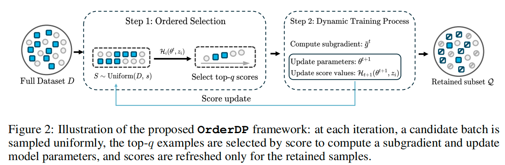

<h1 align="center">
<br>
OrderDP: A Theoretically Guaranteed Lossless Dynamic Data Pruning Framework
</h1>

<p align="center"><b>ICLR 2026 Poster</b> | <a href="https://openreview.net/forum?id=e77QyyRQPz">[Paper]</a></p>

<p align="center">
  <strong>A plug-and-play dynamic data pruning framework with theoretical guarantees for lossless training acceleration.</strong>
</p>

## Overview

Data pruning (DP), as an oft-stated strategy to alleviate heavy training burdens, reduces the volume of training samples according to a well-defined pruning method while striving for near-lossless performance. However, existing approaches, which commonly select highly informative samples, can lead to biased gradient estimation compared to full-dataset training, and the analysis of this bias and its impact on final performance remains ambiguous.

To address these challenges, we propose OrderDP, a plug-and-play framework that aims to obtain stable, unbiased, and near-lossless training acceleration with theoretical guarantees. Specifically, OrderDP first randomly selects a subset and then chooses the top-q samples, where unbiasedness is established with respect to a surrogate loss; this ensures that OrderDP conducts unbiased training in terms of the surrogate objective.

<p align="center">
  
</p>

We further establish convergence and generalization analyses, elucidating how OrderDP affects optimal performance and enables well-controlled acceleration while ensuring guaranteed final performance. Empirically, we evaluate OrderDP against comprehensive baselines on CIFAR-10, CIFAR-100, and ImageNet-1K, demonstrating competitive accuracy, stable convergence, and exact control—all with a simpler design and faster runtime, while reducing training cost by over 40%. Delivering both strong performance and computational efficiency, our method serves as a robust and easily adaptable tool for data-efficient learning.

## Get Started

- **Code release**: The official PyTorch implementation for CIFAR and ImageNet will be released here.
- **Environment & installation**: Detailed dependencies and setup instructions will be added once the first code drop is complete.
- **Reproduction guide**: We will provide step-by-step commands to reproduce the main results in the paper.


## Citation

If you find OrderDP useful in your research, please consider citing:

```bibtex
@inproceedings{
  jin2026orderdp,
  title={Order{DP}: A Theoretically Guaranteed Lossless Dynamic Data Pruning Framework},
  author={Chenhan Jin and Shengze Xu and Qingsong Wang and Fan JIA and Dingshuo Chen and Tieyong Zeng},
  booktitle={The Fourteenth International Conference on Learning Representations},
  year={2026},
  url={https://openreview.net/forum?id=e77QyyRQPz}
}
```

## Acknowledgements

This work builds on the open-source PyTorch ecosystem and prior research on data pruning and importance sampling. Our implementation is inspired in part by the InfoBatch codebase (`https://github.com/NUS-HPC-AI-Lab/InfoBatch`). We thank our collaborators, the InfoBatch authors, and the broader community for discussions and feedback that helped shape OrderDP.

